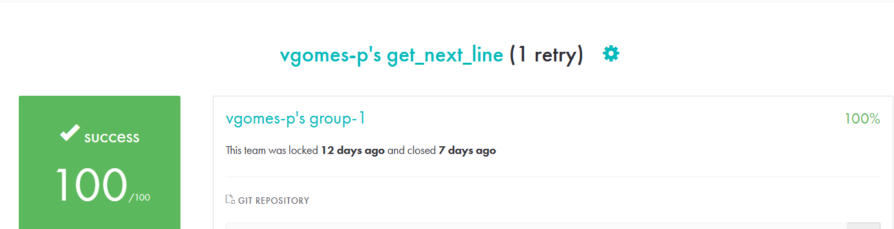

## O get_next_line é uma função em C que permite a leitura de um arquivo, uma linha por vez. Desenvolvido como parte do currículo da 42, o projeto tem como objetivo trabalhar com a manipulação de buffers, controle de memória e otimização de desempenho em leitura sequencial.

### Data de início:
Eu iniciei o trabalho na gnl dia 12 de Novembro de 2024.
### Data de entrega:
Validei o projeto no dia 8 de Dezembro de 2024.

